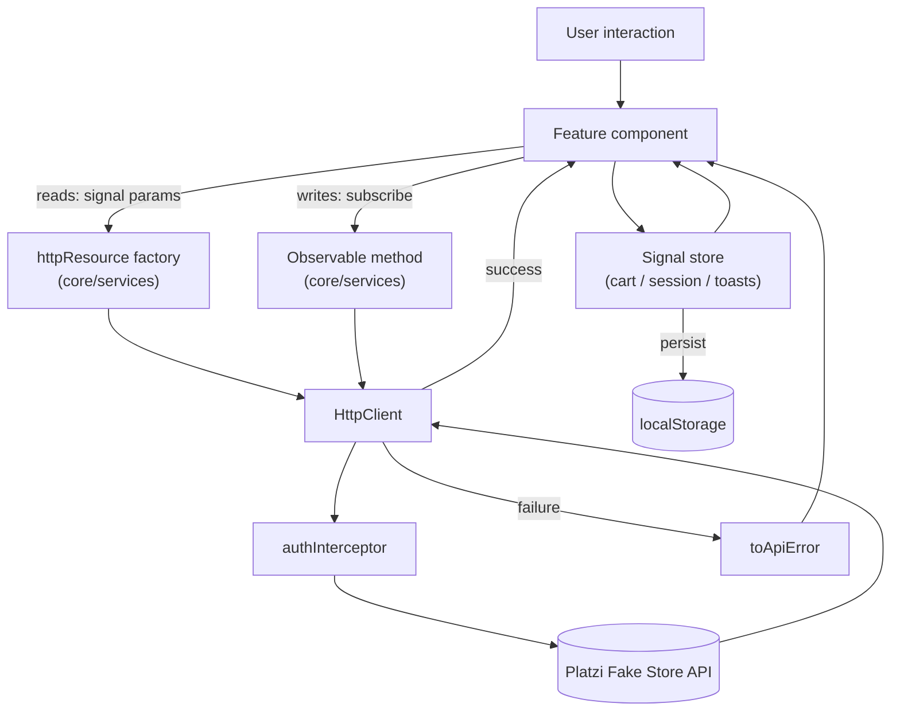

# Architecture

How the code is organised, how data moves through it, and what rules hold it together.

For the reasoning behind the less obvious choices, see [DECISIONS.md](DECISIONS.md).

---

## Layers

```
┌──────────────────────────────────────────────────────────┐
│  features/            Route-level screens (lazy loaded)  │
│  layout/              Header, footer                     │
├──────────────────────────────────────────────────────────┤
│  shared/ui/           Presentational components          │
├──────────────────────────────────────────────────────────┤
│  core/state/          Signal stores (app state)          │
│  core/services/       API clients                        │
│  core/models/         Types + error normalisation        │
│  core/guards/         Route protection                   │
│  core/interceptors/   Cross-cutting HTTP concerns        │
└──────────────────────────────────────────────────────────┘
```

### Dependency rules

Imports only ever point **downward** in that diagram:

| Layer | May import | Must never import |
| --- | --- | --- |
| `features/` | `shared/ui`, `core/*` | other `features/` |
| `layout/` | `shared/ui`, `core/*` | `features/` |
| `shared/ui/` | `core/models`, `core/state` | `features/`, `core/services` |
| `core/state/` | `core/services`, `core/models` | anything visual |
| `core/services/` | `core/models` | `core/state`, anything visual |
| `core/models/` | nothing | everything |

Two consequences worth stating explicitly:

- **Features never import each other.** Anything two features both need moves down into
  `shared/ui` or `core`.
- **Services never read state.** They translate HTTP into typed results and nothing more.
  A service that needed the current user would create a cycle with the interceptor; see
  [Token vs session](#token-vs-session) below.

---

## Data flow



### Reads use `httpResource`

Read paths are exposed as **resource factories** that take reactive parameter functions:

```ts
// core/services/product-api.ts
productsResource(query: () => ProductQuery): HttpResourceRef<Product[]>
```

The component supplies a `computed` and gets back `value()`, `isLoading()`, `error()`, and
`reload()` as signals. When any signal read inside `query` changes, the resource cancels the
in-flight request and issues the next one.

Every factory passes `injector: this.injector`, so it can be called from anywhere — not just
a field initialiser.

```ts
// features/catalog/catalog/catalog.ts
private readonly query = computed<ProductQuery>(() => ({
  title: this.search() || undefined,
  priceMin: this.minPrice(),
  priceMax: this.maxPrice(),
}));

protected readonly products = this.productApi.productsResource(this.query);
```

### Writes use `HttpClient`

Mutations return cold observables and are subscribed by the caller, usually inside a Signal
Forms `submit()` block via `firstValueFrom`. This keeps the busy/error state next to the form
that owns it.

### Errors are normalised at the edge

The API returns **three different error envelopes** (see
[API.md](API.md#4-three-different-error-envelopes)).
`toApiError()` in `core/models/api-error.ts` collapses all of them into one shape:

```ts
interface ApiError {
  kind: 'not-found' | 'validation' | 'unauthorized' | 'network' | 'unknown';
  status: number;
  message: string;          // safe to render
  details: readonly string[]; // per-field validation messages
}
```

Observable methods `catchError` into this type, so components never see an
`HttpErrorResponse`. Resources expose the raw error on `error()`, so components pass it
through `toApiError` themselves:

```ts
protected readonly error = computed(() => {
  const failure = this.product.error();
  return failure ? toApiError(failure) : undefined;
});
```

The `kind` field matters: a missing record arrives as HTTP **400**, not 404, so
`kind === 'not-found'` is the only reliable way to detect it.

---

## State

All application state is held in signal stores under `core/state/`. There is no NgRx, no
RxJS subject soup, and no `BehaviorSubject` — just `signal`, `computed`, and `linkedSignal`.

| Store | Owns | Persisted |
| --- | --- | --- |
| `CartStore` | Cart lines and derived money totals | `localStorage` |
| `TokenStore` | JWT access + refresh pair | `localStorage` |
| `SessionStore` | Current user, session lifecycle | no (derived from token) |
| `ThemeStore` | Light / dark / system preference | `localStorage` |
| `ToastStore` | Transient notifications | no |

### Derived, never duplicated

Anything computable is a `computed`, so it cannot drift out of sync. `CartStore` stores only
the lines; `itemCount`, `totals`, and `amountToFreeShipping` are all derived:

```ts
readonly totals = computed<CartTotals>(() => { /* subtotal, shipping, tax, total */ });
```

Cart economics live in one place at the top of `cart-store.ts`:

| Constant | Value |
| --- | --- |
| `FREE_SHIPPING_THRESHOLD` | `150` |
| `SHIPPING_FLAT_RATE` | `9.9` |
| `TAX_RATE` | `0.08` |
| `MAX_QUANTITY_PER_LINE` | `99` |

### Persistence is SSR-safe

`core/state/browser-storage.ts` wraps `localStorage` behind a platform check. During SSR
reads return `undefined` and writes are no-ops, so a store falls back to its initial value on
the server and hydrates on the client. Writes are also wrapped in `try/catch` for private
mode and quota errors.

Keys are namespaced: `fake-store:cart:lines`, `fake-store:auth:tokens`,
`fake-store:theme:preference`.

Stores persist **synchronously inside the mutation**, not from an `effect`. See
[DECISIONS.md](DECISIONS.md#cart-persistence-does-not-go-through-an-effect).

### Token vs session

Auth state is deliberately split across two stores:

```
TokenStore     ─ no HTTP dependency ─→  read by authInterceptor
    ↑
SessionStore   ─ injects AuthApi ─────→  used by components and guards
```

`authInterceptor` needs the access token on every request. If it read `SessionStore`, which
injects `AuthApi`, which injects `HttpClient`, which runs the interceptor, DI would form a
cycle. `TokenStore` holds the tokens and nothing else, breaking it.

`SessionStore` self-initialises: its constructor kicks off the profile restore and stores the
resulting promise, exposed as `whenReady()`. Guards **must** await that promise — without it,
a cold load of a guarded URL runs the guard before the profile arrives and bounces a valid
session to the login page.

```ts
export const authGuard: CanActivateFn = async (_route, state) => {
  const session = inject(SessionStore);   // inject() first — before any await
  const router = inject(Router);

  await session.whenReady();

  if (session.isAuthenticated()) return true;
  return router.createUrlTree(['/login'], { queryParams: { redirectTo: state.url } });
};
```

> `inject()` is only legal in the synchronous part of a guard. Inject everything up front,
> then await.

---

## Routing

Every feature is lazily loaded with `loadComponent`, so the initial bundle carries only the
shell and the catalogue.

| Path | Component | Guard |
| --- | --- | --- |
| `/` | Catalog | — |
| `/products/:slug` | ProductDetail | — |
| `/cart` | CartPage | — |
| `/checkout` | Checkout | — |
| `/stores` | Stores | — |
| `/login` | Login | — |
| `/register` | Register | — |
| `/account` | Account | `authGuard` |
| `/admin` | AdminShell | `adminGuard` |
| `/admin/products` | AdminProducts | inherited |
| `/admin/products/new` | ProductForm | inherited |
| `/admin/products/:id/edit` | ProductForm | inherited |
| `/admin/categories` | AdminCategories | inherited |
| `**` | NotFound | — |

Products are addressed **by slug, not id**, because IDs are recycled by the daily reseed
while slugs remain readable and stable for the life of a record. `ProductForm` still uses
`:id`, since editing targets a specific record in a session that just listed it.

Router features enabled in `app.config.ts`:

- `withComponentInputBinding()` — route params can bind straight to component inputs
- `withInMemoryScrolling()` — restores scroll position on back, top on forward
- `withViewTransitions()` — cross-fades route changes where supported, neutralised by the
  `prefers-reduced-motion` block in `styles.css`

---

## Server-side rendering

Render mode is chosen per route in `app.routes.server.ts`:

| Routes | Mode | Why |
| --- | --- | --- |
| `/login`, `/register` | **Prerender** | Fully static; nothing to fetch |
| `/`, `/products/:slug`, `/stores` | **Server** | Content-bearing and indexable, but data changes daily so it cannot be baked at build time |
| `/cart`, `/checkout`, `/account`, `/admin/**` | **Client** | Meaningless without `localStorage` or a session; SSR would only flash an empty shell |
| `**` | **Server**, `status: 404` | Returns a real 404 instead of a soft-404 |

Product routes deliberately are *not* prerendered: slugs live in a database that is reseeded
daily, so there is no build-time list to enumerate and any prerendered page would be stale
within hours.

`provideClientHydration()` enables the HTTP transfer cache by default, so products fetched
during SSR are reused on the client instead of being requested a second time.

---

## Change detection

The app is **zoneless** — `zone.js` is not a dependency. Every component sets
`ChangeDetectionStrategy.OnPush` (the default in Angular v22) and all rendered state flows
through signals.

Practically this means:

- No `setTimeout`-then-hope patterns; state changes schedule their own updates.
- Tests use `TestBed.tick()` or `fixture.whenStable()` rather than `detectChanges()`.
- Anything read in a template must be a signal, or it will not trigger a re-render.

---

## Forms

All forms use **Signal Forms** (`@angular/forms/signals`). A form is a signal model plus a
schema of rules:

```ts
protected readonly model = signal({ email: '', password: '' });

protected readonly loginForm = form(this.model, (path) => {
  required(path.email, { message: 'Enter your email address.' });
  email(path.email, { message: 'That does not look like an email address.' });
  required(path.password, { message: 'Enter your password.' });
});

protected signIn(): void {
  submit(this.loginForm, async () => { /* only runs when valid */ });
}
```

Conventions used throughout:

- Model fields are never `null` or `undefined` — `''`, `0`, or `[]` instead.
- Field state is reached by **calling** the field: `form.email().errors()`, not
  `form.email.errors()`.
- `submit()` marks everything touched, so errors appear on first submit.
- Errors render below their field with an icon and `role="alert"`.
- `<select>` binds to **string** fields; `ProductForm` keeps `categoryId` as a string and
  converts with `Number()` when building the request body.

`Register` uses `validateAsync` against the API's `/users/is-available` endpoint to check
email availability while typing.

---

## Where to make a change

| I want to… | Go to |
| --- | --- |
| Change what the API returns or how it is called | `core/services/` |
| Add a field to a typed contract | `core/models/` |
| Change cart maths or persistence | `core/state/cart-store.ts` |
| Change who can reach a route | `core/guards/auth-guard.ts` |
| Change a screen | `features/<feature>/` |
| Change a shared control | `shared/ui/` |
| Change colour, type, or a button style | `src/styles.css` |
| Change SSR behaviour for a route | `app.routes.server.ts` |
